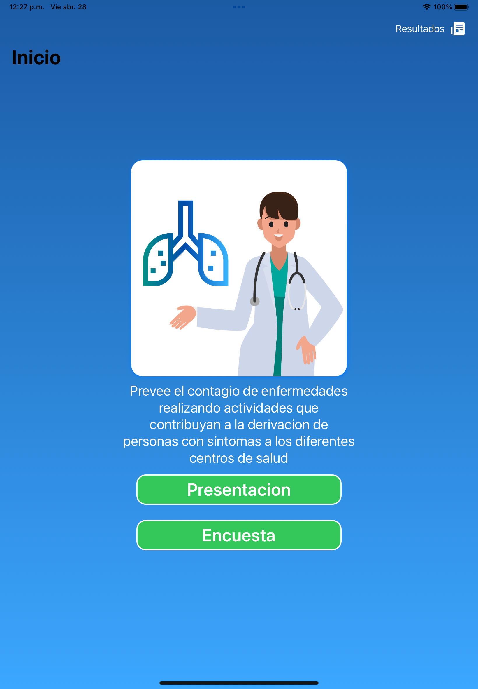
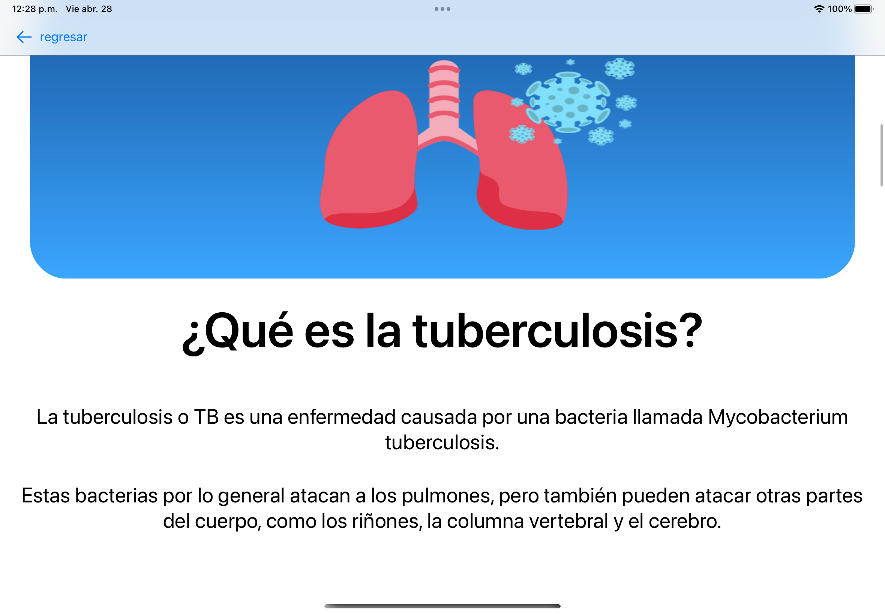

# Proyecto TB info fase local Hackaton 2023

Este proyecto tiene como objetivo ayudar a identificar si una persona podría estar infectada con tuberculosis. Incluye información sobre la enfermedad y una encuesta que se puede completar para saber si una persona debe buscar atención médica.

## Tabla de contenido

- [Información sobre la tuberculosis](#información-sobre-la-tuberculosis)
- [Encuesta de Tuberculosis](#encuesta-de-tuberculosis)

## Información sobre la tuberculosis

La tuberculosis es una enfermedad infecciosa que se propaga a través del aire y afecta principalmente a los pulmones. Es causada por una bacteria llamada Mycobacterium tuberculosis.

Los síntomas de la tuberculosis incluyen tos persistente, fiebre, sudores nocturnos, pérdida de peso y fatiga. Si no se trata, la tuberculosis puede ser mortal.

Para obtener más información sobre la tuberculosis, consulte [este enlace](https://www.who.int/es/news-room/fact-sheets/detail/tuberculosis).

## Encuesta de Tuberculosis

La encuesta de tuberculosis está diseñada para ayudar a identificar si una persona podría estar infectada con tuberculosis. La encuesta hace preguntas sobre los síntomas de la enfermedad y también solicita información sobre el historial médico del encuestado.

## Cómo ejecutar el proyecto

Para ejecutar el proyecto, siga los siguientes pasos:

1. Clone este repositorio en su máquina local.

2. Abra el archivo `EncuestaTuberculosis.xcodeproj` en Xcode.

3. Ejecute la aplicación en el simulador o en un dispositivo conectado.

4. Complete la encuesta para determinar si podría estar infectado con tuberculosis.

## Contribución

¡Estamos abiertos a contribuciones de cualquier tipo! Si desea contribuir a este proyecto, haga lo siguiente:

1. Forquee este repositorio.

2. Cree una nueva rama para sus cambios.

3. Realice los cambios necesarios en la rama.

4. Envíe una solicitud de extracción desde su rama a la rama principal.

## Licencia

Este proyecto está bajo la Licencia MIT. Para obtener más información, consulte el archivo `LICENSE`.
